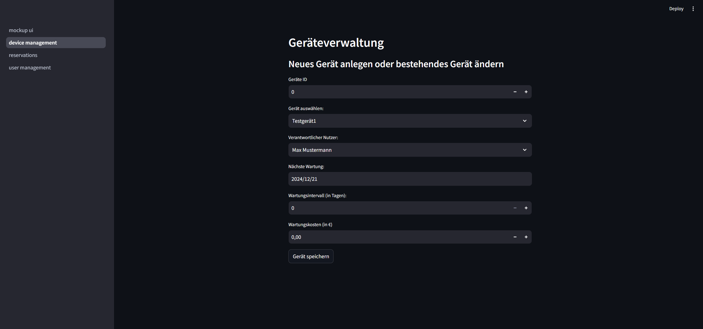
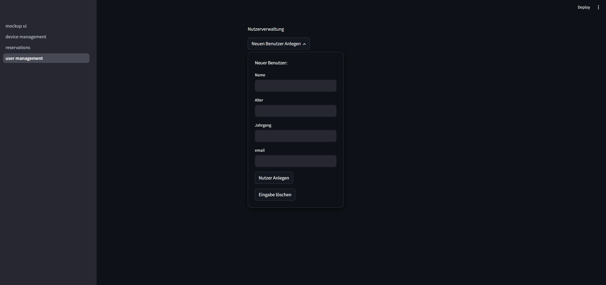
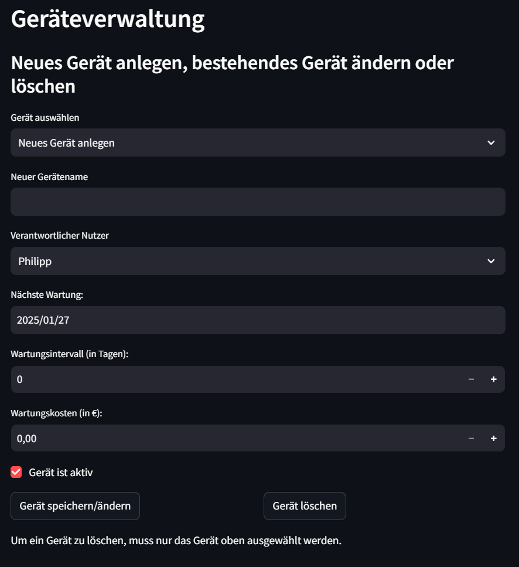
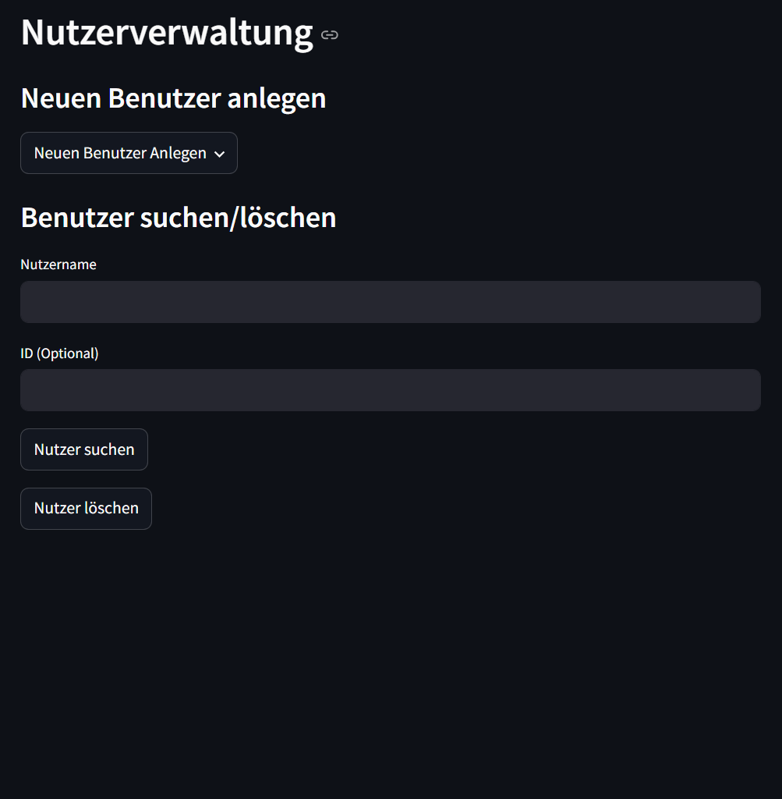
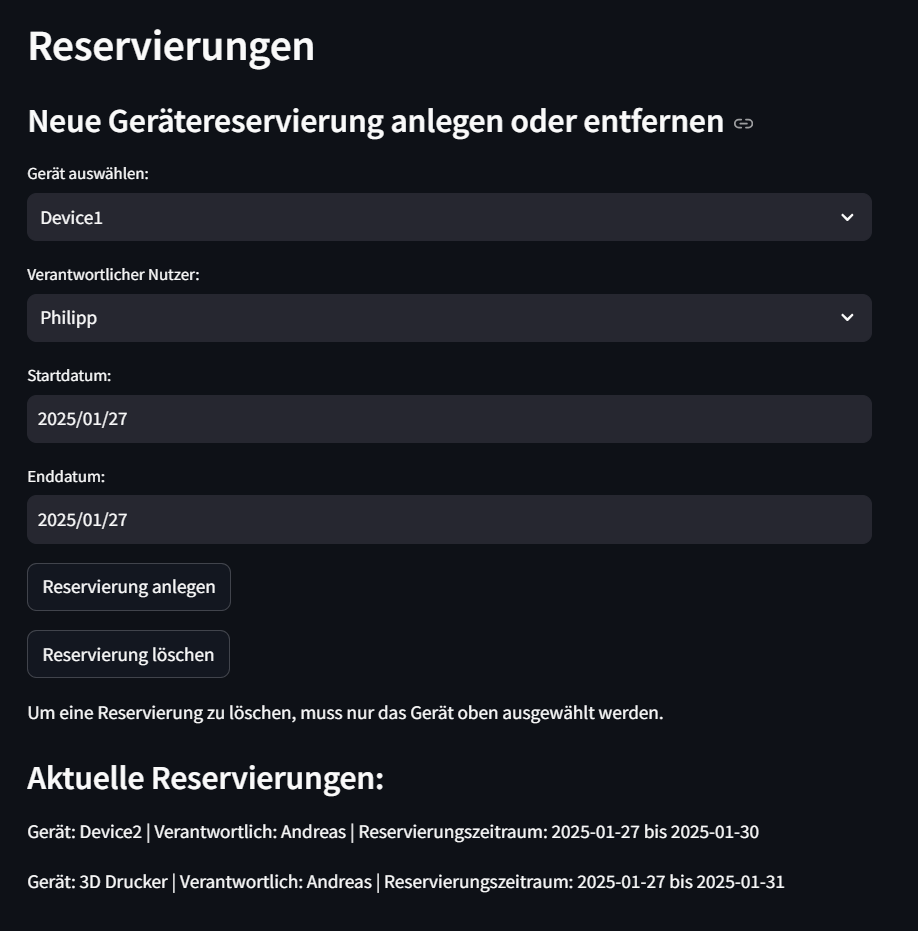

# Case-Study-Softwaredesign

## CaseStudy I - Abgabe I
Es wurde eine Benutzeroberfläche für eine Geräteverwaltung an einer Hochschule mittels Streamlit erstellt.
Die erste Abgabe befasst sich nur mit dem Frontend beziehungsweise der Erstellung des Mockups. Die Streamlit App enthält folgende Seiten:
- Geräteverwaltung
- Nutzerverwaltung
- Reservierungen

Die Streamlit App kann mittels folgendem Befehl gestartet werden:
python -m streamlit run mockup_ui.py

## Screenshots
### Geräteverwaltung

### Nutzerverwaltung

### Reservierungen

## CaseStudy I - Abgabe II
Die zweite Abgabe befasste sich mit dem Backend. Es wurde mit TinyDB eine funktionierende Geräte-Verwaltung und Nutzer-Verwaltung programmiert.

 

## CaseStudy II - Abgabe
### Funktionierende Reservierungsseite
