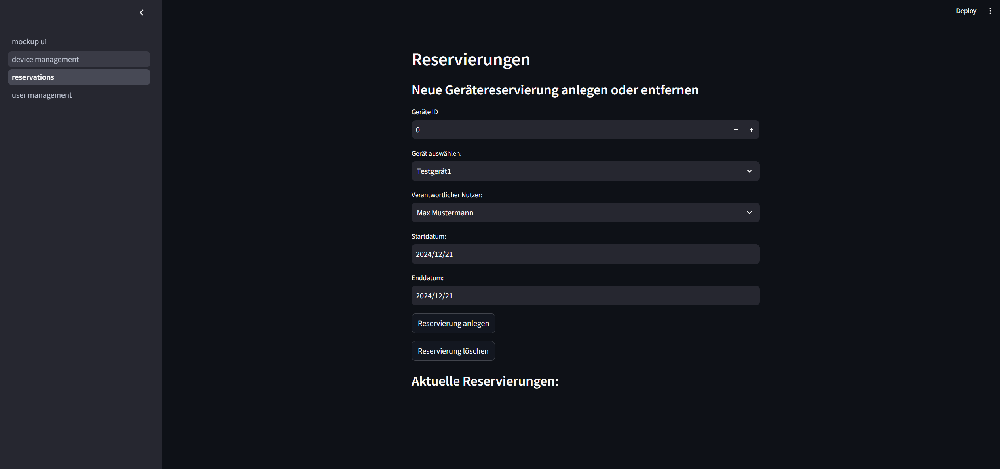

# Case-Study-Softwaredesign

## CaseStudy I - Abgabe I
Es wurde eine Benutzeroberfläche für eine Geräteverwaltung an einer Hochschule mittels Streamlit erstellt.
Die erste Abgabe befasst sich nur mit dem Frontend. Die Streamlit App enthält folgende Seiten:
- Geräteverwaltung
- Nutzerverwaltung
- Reservierungen

Die Streamlit App kann mittels folgendem Befehl gestartet werden:
python -m streamlit run mockup_ui.py

## Screenshots
### Geräteverwaltung

### Nutzerverwaltung

### Reservierungen
